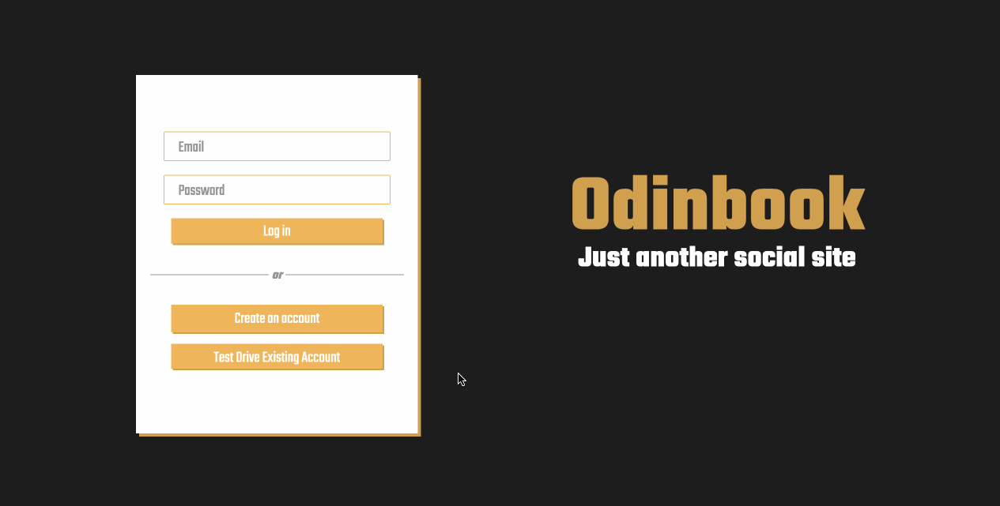
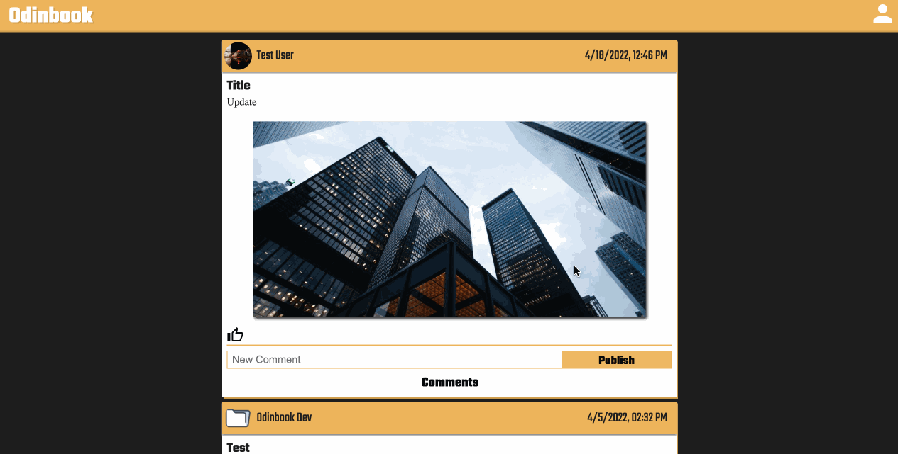
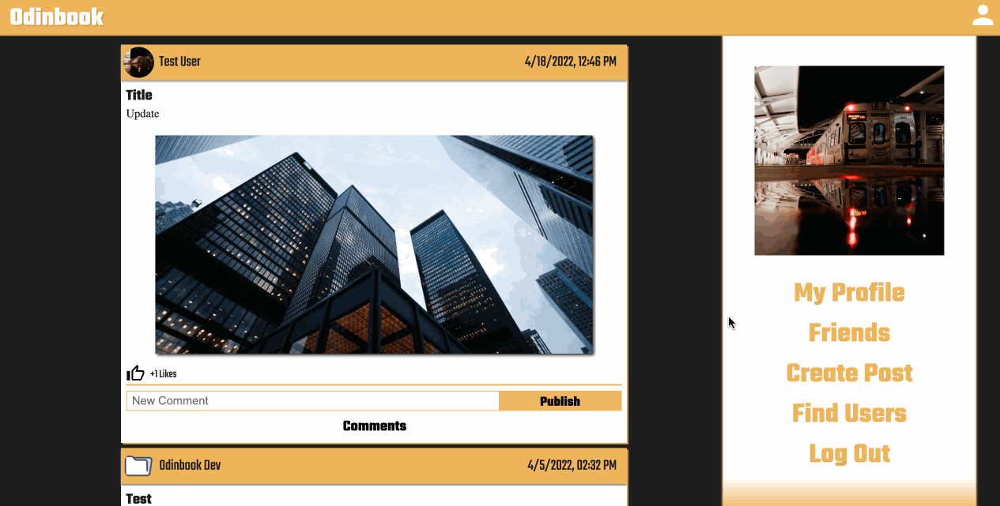

# Odinbook (Just another social site)

Many of this project's features were built with The Odin Project's web development curriculum in mind, but have slight variations from the specifications that I felt were needed to make it a bit more unique.

The main focus here was to help me get a better grasp on CRUD operations, the React framework, and Express APIs.
All data is stored in a MongoDB collection, with the exception of image files which are stored separately on an AWS S3 bucket.

## Development
This repository is actually a refactored version of the same project, but uses Redux Toolkit and better component layouts for improving performance, reducing API calls, and generally having cleaner code with less prop drilling all around.

The Express backend repo can be found [here.](https://github.com/MitchellWayne/odin-book-backend)

The old React repo with commits for most of the feature implementation found [here.](https://github.com/MitchellWayne/odin-book-frontend) (This repo does not use Redux Toolkit, and is generally less organized than the current repo).

## Some feature previews

  
Login

  

  
Like and comment on posts

  

  
Filtering the feed

  

  
Creating a post and viewing it on the profile

  

